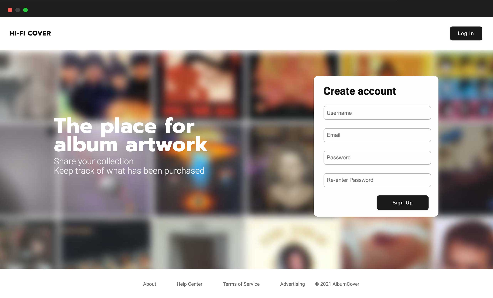
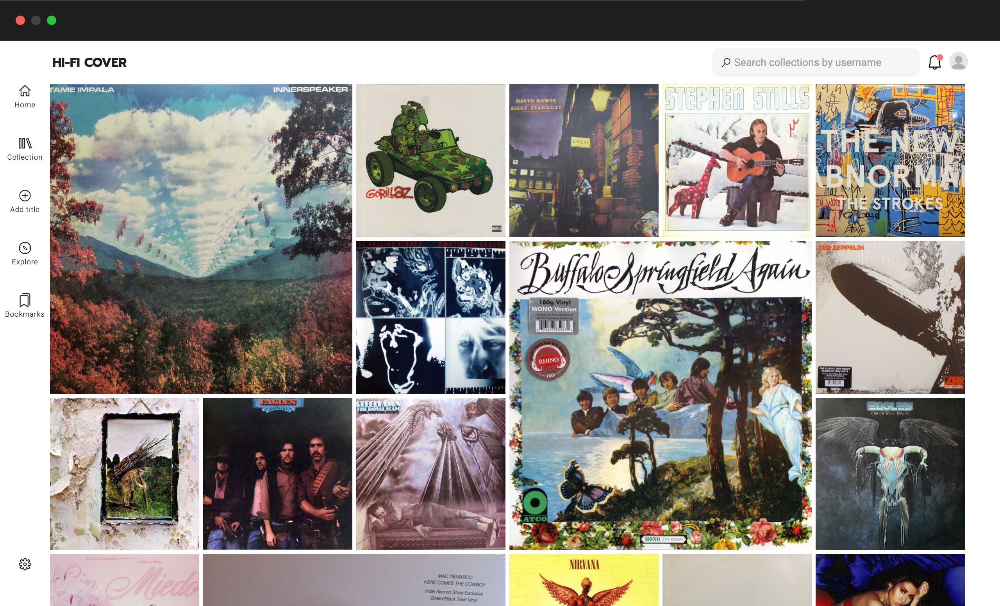

 

  

<h3 align="center">Hi-Fi Cover</h3>

  

Cataloging application for vinyl record collection. 
     
    <a href="https://hificover.herokuapp.com/">View Demo</a>
    
  

  
Table of Contents

  <ol>
    <li>
      <a href="#info">Info</a>
      <ul>
        <li><a href="#built-with">Built With</a></li>
      </ul>
    </li>
    <li>
      <a href="#getting-started">Getting Started</a>
      <ul>
        <li><a href="#prerequisites">Prerequisites</a></li>
        <li><a href="#installation">Installation</a></li>
      </ul>
    </li>
    <li><a href="#usage">Usage</a></li>
    <li><a href="#roadmap">Roadmap</a></li>
    <li><a href="#contributing">Contributing</a></li>
    <li><a href="#license">License</a></li>
    <li><a href="#contact">Contact</a></li>
    <li><a href="#acknowledgments">Acknowledgments</a></li>
  </ol>

## Info
   
  
 

The app came about from the need of cataloging my music collection. Information is gathered using Discogs API. The user inputs a catalog number for a specific album and in return is the album artwork and track titles, along with other credits. This information is then stored for each user.

(<a href="#top">back to top</a>)

### Built With
* [React.js](https://reactjs.org/)
* [Axios](https://axios-http.com/)
* [Node.js](https://nodejs.org/en/)
* [Express.js](https://expressjs.com/)
* [MongoDb](https://www.mongodb.com/)
* [Heroku](https://www.heroku.com/)

  

(<a href="#top">back to top</a>)

## Roadmap

- Users are able to add a title to the collection via catalog number. A request is sent to discogs api to retrive information and send the post request to the mongoDB.
  
    
   

 
  
- Bookmark feature for users to save any title they might want to purchase in the future.

   
   

   
 

- User feeds // The home feed is a mixure of both the user collections and the ones are that being followed. 

  

     - Explore feed feature, using all the posts I created a route for users to see what others are uploading to their libraries. For Better UX the images are displayed.
       
   
 

See the [open issues](https://github.com/octaviusg/albumcover/issues) for a full list of proposed features (and known issues).

## License

Distributed under the MIT License. 

(<a href="#top">back to top</a>)

## Contact

Octavio Garcia - [@octaviodevs](https://www.instagram.com/octaviodevs/) - hello@octaviogarcia.co

Project Link: [https://github.com/octaviusg/albumcover](https://github.com/octaviusg/albumcover)

(<a href="#top">back to top</a>)

## Acknowledgments

* [Discogs API](https://www.discogs.com/developers)

(<a href="#top">back to top</a>)

